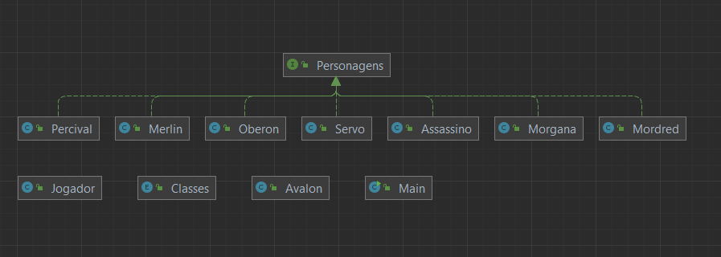
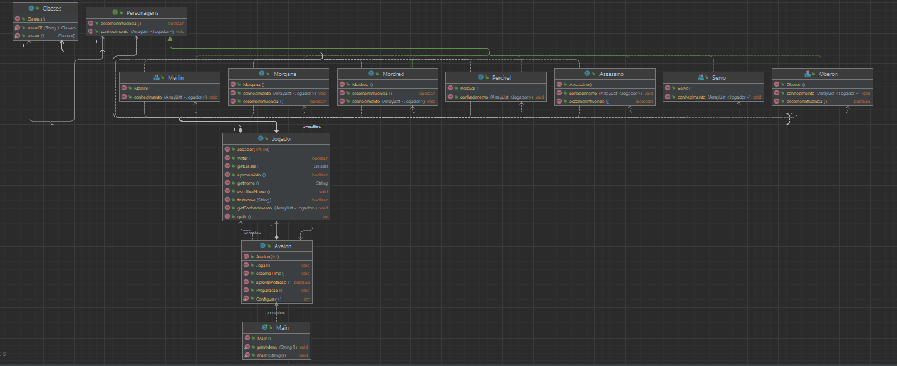

# imd0040-tfinal

## Link para vídeo de apresentação

 Tempo máximo de 5 minutos

## Descrição do trabalho

 O nosso trabalho é o desenvolvimento de um jogo com interatividade pelo terminal, utilizamos o jogo The Resistence: 
 Avalon , o qual é um boardgame como inspiração/modelo, feito na linguagem java, nós utilizamos de diferentes classes
 para compor o projeto como também interfaces visando cumprir com os requisitos dados para o trabalho
 assim como para melhorar a comunicação entre as classes e objetos. Utilizamos do Gradle para estruturação do projeto 
 e assim como orientado fizemos a organização do projeto em pacotes , no caso o package "com.avalon". Não fizemos uso
 de Generics no código.

## Diagrama de classes
> 
> 
> Diagrama Geral
> 

## Instruções para build e execução

Para compilar o projeto basta digitar:
``` 
./gradlew build
```
e para executar: 
```
./gradlew run
```